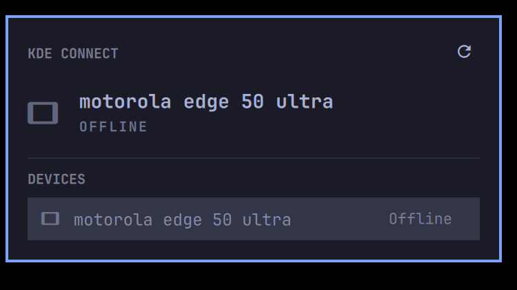

# Omarchy Connect

**Omarchy Connect brings KDE Connect directly into the Quattro shell.**

Pair devices, see live connection and battery state, find your phone, send
clipboard content and access device actions from a native Omarchy panel —
without running Plasma or a separate KDE Connect frontend.



## Highlights

- **Native Quickshell/Quattro UI** — theme tokens, bar orientation, keyboard
  navigation; a screenshot should look like it shipped with Omarchy.
- **Event-driven D-Bus integration** — one persistent bus monitor invalidates
  a debounced snapshot; no polling, no idle process churn.
- **Multi-device** — primary-device precedence with a persisted preference,
  correct behaviour when devices disappear and return.
- **Native pairing** — incoming and outgoing requests with verification-key
  display, accept/reject from the panel.
- **Battery + charging** in the bar and panel when the device supports it.
- **Find Device, Ping, Send Clipboard** — capability-driven: actions appear
  only when the device's KDE Connect plugins provide them.
- **Useful failure states** — distinguishes "not installed", "daemon not
  running", "no devices", "device offline" instead of one "Disconnected".
- **No custom daemon, no protocol reimplementation** — KDE Connect keeps
  ownership of networking, encryption and discovery; this plugin owns only
  the shell experience. Zero build step: QML + `busctl` + `kdeconnect-cli`.

Notifications, clipboard sync and media controls are deliberately *not*
duplicated — KDE Connect's existing plugins already flow through Omarchy's
native notification, clipboard and media surfaces.

## Requirements

```
sudo pacman -S kdeconnect
```

`busctl` (systemd) and Omarchy Quattro's `omarchy-shell` are already part of
Omarchy. The KDE Connect app must be installed on the phone/tablet
([Android](https://play.google.com/store/apps/details?id=org.kde.kdeconnect_tp),
[iOS](https://apps.apple.com/app/kde-connect/id1580245991), F-Droid).

## Install

```
git clone <repo-url> ~/.config/omarchy/plugins/hannibalp.kdeconnect
omarchy-shell shell enablePlugin hannibalp.kdeconnect '{}'
```

Or enable it from the bar's widget picker. KDE Connect discovers devices over
TCP/UDP ports 1714–1764 on the local network; a restrictive firewall blocks
discovery (the plugin will tell you, but never modifies firewall rules).

## Architecture

```
kdeconnectd ── session D-Bus ──┬── busctl monitor (events → debounced snapshot)
                               ├── busctl call    (structured state)
                               └── kdeconnect-cli (actions)
                                        │
                                   Service.qml (normalized state)
                                        │
                              bar indicator + panel
```

- `Dbus.qml` — transport: serial `busctl` call queue, persistent filtered
  bus monitor with restart backoff.
- `Model.js` — pure parsing/normalization; unit-tested against captured
  `busctl` fixtures (`node tests/model.test.js`).
- `Service.qml` — state, snapshot reconciliation, actions, pairing.
- `Panel.qml` — bar widget + panel presentation.

## License

MIT
