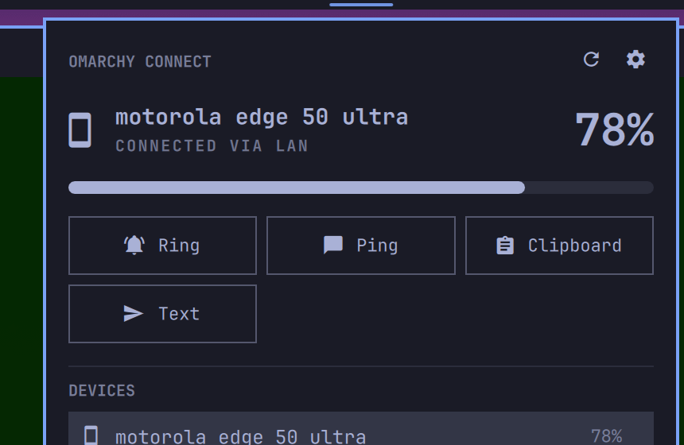

# Omarchy Connect

**Omarchy Connect brings KDE Connect directly into the Quattro shell.**

Pair devices, see live connection and battery state, find your phone, send
clipboard content and share text from a native Omarchy panel — without running
Plasma or a separate KDE Connect frontend.



## Highlights

- **Native Quickshell/Quattro UI** — theme tokens, bar orientation, keyboard
  navigation; a screenshot should look like it shipped with Omarchy.
- **Event-driven D-Bus integration** — one persistent bus monitor invalidates
  a debounced snapshot; no polling, no idle process churn.
- **Multi-device** — primary-device precedence with a persisted preference,
  correct behaviour when devices disappear and return.
- **Native pairing** — incoming and outgoing requests with verification-key
  display, accept/reject from the panel. Can optionally suppress KDE's duplicate
  system pairing popup (opt-in) so the panel owns the flow.
- **Battery + charging** in the bar and panel when the device supports it.
- **Find Device, Ping, Send Clipboard, Share Text, Browse Files** —
  capability-driven: actions appear only when the device's KDE Connect plugins
  provide them, and each can be hidden in settings. **Browse Files** opens the
  device's storage in your file manager and registers a `kdeconnect://` handler,
  so KDE Connect's own "Explore device" button works on Omarchy too (see
  [Remote files](#remote-files)).
- **Useful failure states** — distinguishes "not installed", "daemon not
  running", "no devices" and "device offline" instead of one "Disconnected".
- **No custom daemon, no protocol reimplementation** — KDE Connect keeps
  ownership of networking, encryption and discovery; this plugin owns only the
  shell experience. Zero build step: QML + `busctl` + `kdeconnect-cli`.

Omarchy Connect deliberately does **not** duplicate notifications, clipboard
sync or media controls — KDE Connect's existing plugins already flow through
Omarchy's native notification, clipboard and media surfaces.

## Requirements

Omarchy Connect is a frontend for KDE Connect, so KDE Connect must be installed
on this machine. `kdeconnect` is in the official Arch `extra` repo; install it
with Omarchy's package helper:

```bash
omarchy-pkg-add kdeconnect
```

(`omarchy-pkg-add` wraps `pacman -S --needed` with sudo handling — no AUR
needed. Plain `sudo pacman -S kdeconnect` works too.)

`busctl` (from systemd) and Quattro's `omarchy-shell` are already part of
Omarchy — nothing else to install on the desktop.

Install the KDE Connect app on the phone/tablet you want to pair:

- **Android** — [Google Play](https://play.google.com/store/apps/details?id=org.kde.kdeconnect_tp)
  or [F-Droid](https://f-droid.org/packages/org.kde.kdeconnect_tp/)
- **iOS** — [App Store](https://apps.apple.com/app/kde-connect/id1580245991)

Both devices must be on the same local network. KDE Connect discovers devices
over TCP/UDP ports **1714–1764**; if a firewall is active, allow that range
(Omarchy Connect will surface this in its diagnostics but never edits firewall
rules itself).

The **Browse Files** action installs a small `kdeconnect://` handler using
`busctl` (systemd) and `gio` (glib) — both already present on Omarchy. If
`xdg-mime` (xdg-utils) and `update-desktop-database` (desktop-file-utils) are
available, the handler is registered automatically; the action itself works
without them.

## Install

```bash
omarchy plugin add https://github.com/seb-krz/omarchy-connect.git --enable
```

This clones the plugin into `~/.config/omarchy/plugins/seb-krz.omarchy-connect/`
and adds it to the bar. If you omit `--enable`, enable it later from the bar's
widget picker or with:

```bash
omarchy plugin enable seb-krz.omarchy-connect
```

## Usage

- **Bar indicator** — shows the primary device's glyph, plus battery percentage
  and a charging bolt when available. It dims when the device is offline and
  takes Omarchy's urgent treatment when a device is requesting pairing.
- **Click the indicator** to open the panel. It opens instantly from cached
  state — connection status, battery meter, and the available actions.
- **Pair a device** — a discovered device shows a **Pair** button; an incoming
  request appears as the most prominent card with a verification code to
  confirm on both devices.
- **Actions** — Ring (find your phone), Ping, Send Clipboard, Share Text,
  Browse Files. Only the actions your device actually supports are shown.
- **Keyboard** — the panel is fully keyboard navigable: arrows/`hjkl` move,
  Enter/Space activates, `x` unpairs a selected device (press again to
  confirm), Esc closes.

### Settings

Open the panel and click the gear icon. You can:

- toggle **battery percentage in the bar**;
- **show or hide individual actions** (Ring, Ping, Clipboard, Share Text);
- **suppress KDE's system pairing popup** (opt-in, off by default) so only the
  panel shows pairing requests — enabling it writes one scoped, reversible line
  to `~/.config/kdeconnect.notifyrc`, removed automatically on disable;
- move the widget to the **left, center or right** of the bar.

Settings persist in `~/.config/omarchy/shell.json` under the plugin's entry.

### Remote files

**Browse Files** mounts the device over KDE Connect's SFTP plugin on demand and
opens the directory the phone advertises. On Android that is
`/storage/emulated/0`: the SFTP root itself is not listable, and the daemon
maps its virtual root onto that single storage for you.

The action also installs a desktop integration so KDE Connect's own **Explore
device** button works on Omarchy, which ships Nautilus (no KIO):

- `~/.local/bin/kdeconnect-open` — a `busctl` + `gio` handler; no Python, no
  KIO, no Dolphin;
- `~/.local/share/applications/kdeconnect-url-handler.desktop` — registers
  `x-scheme-handler/kdeconnect`.

It is installed automatically the first time the service runs, and is
idempotent. Manage it by hand with:

```bash
bin/kdeconnect-install install     # idempotent
bin/kdeconnect-install status
bin/kdeconnect-install uninstall
```

There are no IP addresses anywhere: the daemon resolves the device, and the
sshfs mount point is keyed by the stable device id, so a changing DHCP lease is
a non-issue.

## Removal

```bash
omarchy plugin disable seb-krz.omarchy-connect   # remove from the bar
omarchy plugin remove seb-krz.omarchy-connect    # delete the plugin
```

Disabling restores KDE's system pairing popup automatically, so nothing is left
behind. KDE Connect itself is untouched; remove it separately with
`sudo pacman -R kdeconnect` if you no longer want it.

Removing the plugin leaves the small `kdeconnect://` handler behind (it is
harmless and keeps working on its own). Remove it explicitly with
`bin/kdeconnect-install uninstall`.

## Troubleshooting

- **"KDE Connect is not installed"** — run the pacman command above.
- **"Daemon not running"** — start it with `systemctl --user start
  app-org.kde.kdeconnect.daemon@autostart.service`, or use the panel's start
  button.
- **No devices found** — confirm both devices are on the same network with the
  KDE Connect app open, and that ports 1714–1764 aren't firewalled.
- **Device won't connect** — open `kdeconnect-cli -l` in a terminal to see what
  KDE Connect itself reports; Omarchy Connect reflects that same state.

## Architecture

```
kdeconnectd ── session D-Bus ──┬── busctl monitor (events → debounced snapshot)
                               ├── busctl call    (structured state)
                               └── kdeconnect-cli (actions)
                                        │
                                   Service.qml (normalized state)
                                        │
                              bar indicator + panel
```

- `Dbus.qml` — transport: serial `busctl` call queue, persistent filtered bus
  monitor with restart backoff.
- `Model.js` — pure parsing/normalization; unit-tested against captured
  `busctl` fixtures (`node tests/model.test.js`).
- `Service.qml` — state, snapshot reconciliation, actions, pairing.
- `Panel.qml` — bar indicator + panel presentation.
- `Integration.qml` — installs the `kdeconnect://` desktop integration once per
  session (best effort; never affects the panel).
- `bin/` — the `kdeconnect://` handler and its installer.

## License

[MIT](LICENSE) © seb-krz
